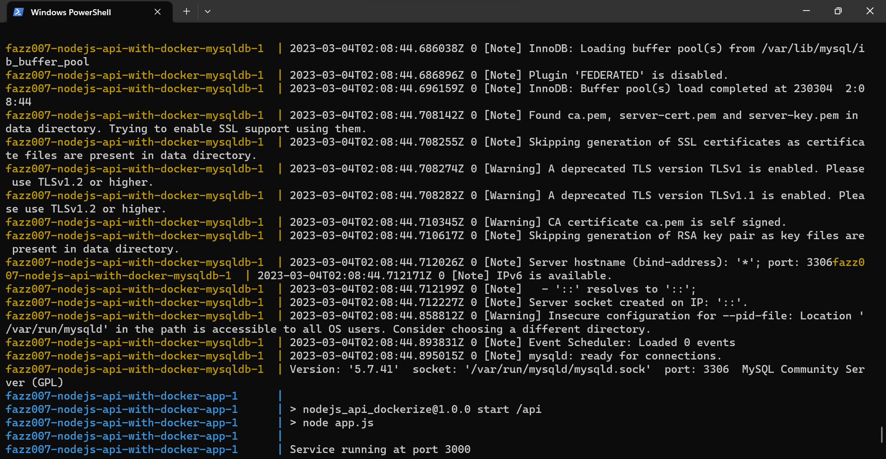
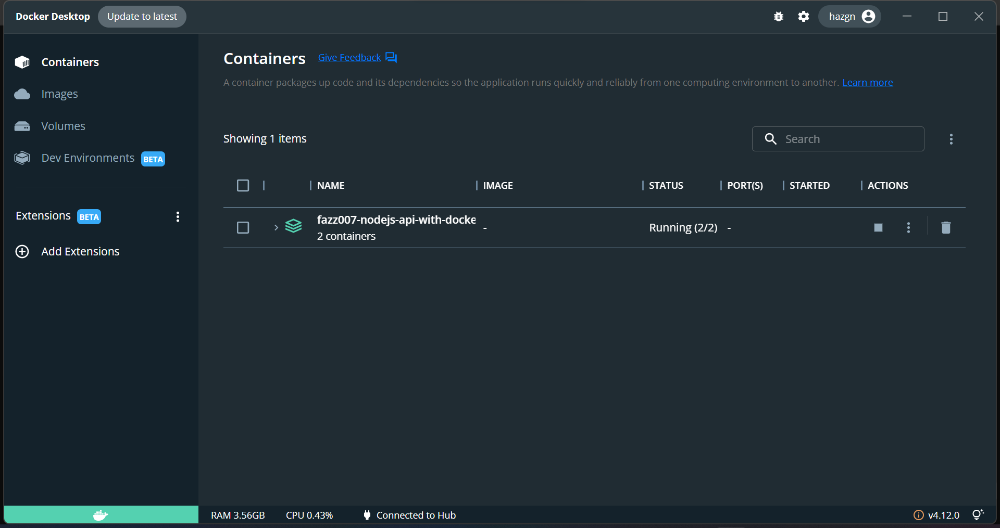
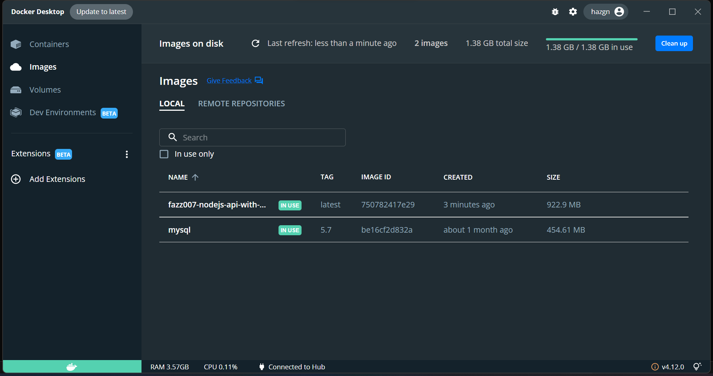
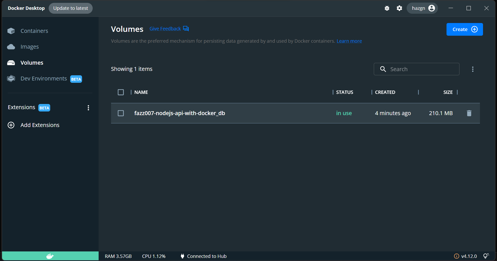
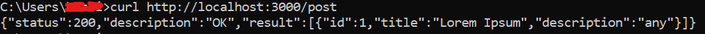
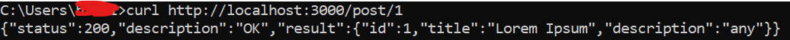
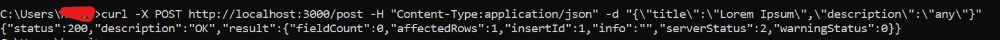
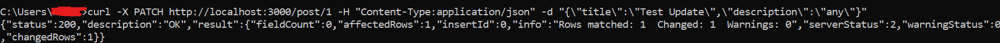
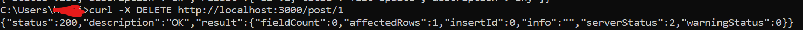

# First of all

Make sure you have set up the environment in the .env file

```
cp .env.example .env
```

fill the .env file with your mysql database environment

```
PORT=YOUR APP PORT
DB_HOST=localhost
DB_USER=YOUR MYSQL USERNAME
DB_PASS=YOUR MYSQL PASSWORD
DB_NAME=YOUR DB NAME
DB_PORT=3306
DOCKER_DB_PORT=3307
```

#### How to Run App in Local

```
npm start
```

or

```
npm run dev
```

# How to Run & Stop App in Docker

#### Run the System

You can easily run the whole with only a single command:

```bash
docker-compose up
```

Docker will pull the MySQL and Node.js images (if our machine does not have it before).

The services can be run on the background with command:

```bash
docker-compose up -d
```

#### Stop the System

Stopping all the running containers is also simple with a single command:

```bash
docker-compose down
```

If you need to stop and remove all containers, networks, and all images used by any service in <em>docker-compose.yml</em> file, use the command:

```bash
docker-compose down --rmi all
```

## Screenhot

- Create Container - Image Docker

 

- Container Docker

  

- Image Docker

  

- Volumes Docker

 

# Test API

You can access http://localhost:3000/ on your browser to check this API is working or not.
To check this API endpoint you can use <a href="https://www.postman.com/">Postman</a> as tools, or you can using curl

GET ALL DATA

```bash
curl http://localhost:3000/post
```

INSERT DATA

```bash
curl -X POST http://localhost:3000/post -H 'Content-Type: application/json' -d '{"title":"Lorem Ipsum","description":"any"}'
```

## Test APi On Curl Windows

- Get ALL Data

```bash
curl http://localhost:3000/post
```



- Get Data By ID

```bash
curl http://localhost:3000/post/1
```



- Insert Data

```bash
curl -X POST http://localhost:3000/post -H "Content-Type:application/json" -d "{\"title\":\"Lorem Ipsum\",\"description\":\"any\"}"
```



- Update Data By ID

```bash
curl -X PATCH http://localhost:3000/post/1 -H "Content-Type:application/json" -d "{\"title\":\"Test Update\",\"description\":\"any\"}"
```



- Delete Data By ID

```bash
curl -X DELETE http://localhost:3000/post/1
```



# Deployment

## <https://fazz007-nodejs-api-with-docker.vercel.app>
